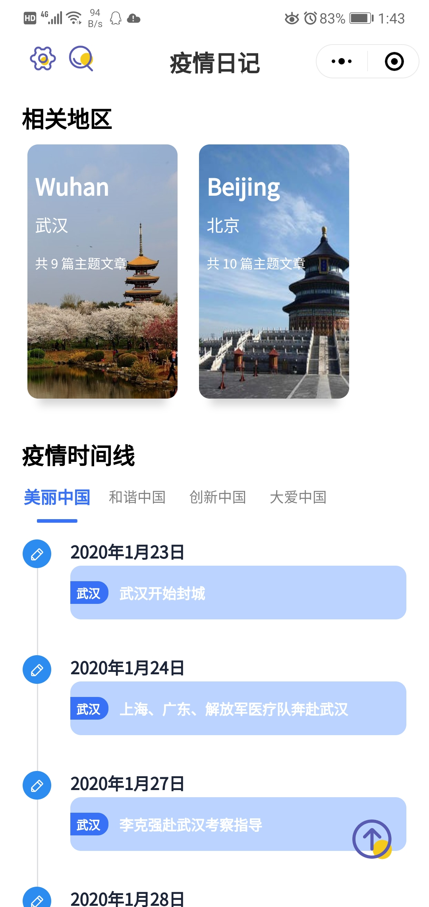

</img>

<h1 align="center">疫情日记</h1>

从另一个角度感受疫情

<!-- Gitee does not seem to support TOC
[TOC]
-->

- [关于疫情日记](#关于疫情日记)
- [我们的优势](#我们的优势)
- [Logo 介绍](#logo-介绍)
- [设计详情及展示](#设计详情及展示)
  - [首页设计——日记分类模块](#首页设计日记分类模块)
  - [日记分类详情模块](#日记分类详情模块)
  - [首页——城市分类模块](#首页城市分类模块)
  - [首页——疫情时间线模块](#首页疫情时间线模块)
  - [城市分类详情页面](#城市分类详情页面)
  - [首页——日记推荐模块](#首页日记推荐模块)
  - [日记正文模块](#日记正文模块)
  - [防疫攻略模块](#防疫攻略模块)
  - [防疫小贴士模块](#防疫小贴士模块)
  - [疫情留言板模块](#疫情留言板模块)
  - [疫情小测验模块](#疫情小测验模块)
  - [搜索模块](#搜索模块)
  - [相关地区模块](#相关地区模块)

## 关于疫情日记

“疫情日记”是一个记录疫情，为用户提供疫情相关知识的微信小程序。“疫情日记”包括“日记正文”、“日记分类”、“主要城市”、“疫情时间线”、“日记推荐”、“防疫攻略”、“防疫小贴士”、“疫情留言板”和“疫情小测验”等多个主要模块，同时还包含了“日记搜索”、“日记收藏”、“浏览历史”、“32张感恩海报”等辅助模块。用户可以通过“疫情日记”多角度、全方位了解疫情发生的起因、经过和主要事件、主要人物。

## 我们的优势

- “疫情日记”基于微信小程序，拥有无需下载安装即可使用的天然优势，同时设计规范，界面美观。

- “疫情日记”紧抓社会热点问题——“新冠肺炎疫情”，素材新颖，热点突出，具有广泛的群众基础。

- “疫情日记”的日记模块按时间线展开，用户可以迅速了解理清疫情期间重大事件的来龙去脉。

- “疫情日记”通过图文、音频、视频等多个媒体角度传递最有价值的疫情知识，用户体验较好。

- “疫情日记”提供“疫情留言板”和“疫情小测验”等交互模块，给用户提供了沟通交流和自我检验的方式。

## Logo 介绍

本微信小程序的logo，首先可以看到4个大字“疫情日记”明确简洁地向用户说明: 小程序的主要内容是以日记的形式来记录疫情, 而logo的主要图案是一个日记，书本形状的图形呼应了小程序的记录疫情的形式“日记” 图案的颜色搭配是黑白搭配，整体感觉简洁大方.

## 设计详情及展示

### 首页设计——日记分类模块

整体使用上下布局，而“日记分类”模块使用栅格布局，干净利落，层次分明，一目了然。首页导航栏左上角留有设置和搜索按钮，给用户提供了前往设置页面和搜索页面的通道；主页上方是一个轮播图，用于展示防疫攻略、防疫小贴士和32张感恩海报等模块。中间是日记分类模块，“疫情日记”拟从“美丽”、“和谐”、“创新”、“大爱”四个角度阐述中国的抗疫过程。

- 美丽中国：主要展示在疫情这么严峻的情况下，众多逆行者众志成城，坚守医者的责任，展现了中国医护人员的美丽。

- 和谐中国：展示面对疫情，中国人民展示出的团结的意志，说禁足就禁足，说戴口罩就戴口罩，说隔离就隔离，体现了中国人民的高度自律，以及面对困难和危险时万众一心的和谐画面。

- 创新中国：展示武汉火神山、雷神山以及方舱医院的建设，以及医药的研制，体现了中国强大的创新能力和基础设施建设能力。

- 大爱中国：展示中国针对国外疫情的帮助，体现出中国的大国风范和对人类命运共同体的遵守。

### 日记分类详情模块

点击日记分类模块的某个分类，即进入该分类的日记分类详情模块。该模块收集了一批分类对应的主题日记，同时按发生时间的顺序排列日记，形成时间线，让用户能够从某一角度全面地了解疫情。

### 首页——城市分类模块

该模块旨在展现疫情严重的主要城市，将该城市的相关日记收集在一起，增加一种空间感，体现新型冠状肺炎波及范围之广，侧面反映出中国能迅速控制住疫情的强大与团结，给用户提供针对性的、全面的日记，增强用户体验。

### 首页——疫情时间线模块

从武汉爆发疫情至全国各省均出现确诊案例，从举国上下万众一心疫情逐渐稳定到海外疫情相继爆发，从西方媒体在中国抗击疫情期间对中国的冷嘲热讽到世界疫情严峻之际中国主动援助他国，2020年的开局并不顺利美好，困难险阻接踵而至，长达数月的抗疫史，发生了诸多重大事件，该模块旨在为用户针对特定方面理清时间线，使用户快速明晰疫情发展与抗疫的过程。

### 城市分类详情页面

点击城市分类模块的某个城市，即进入该城市的城市分类详情模块。该模块收集了一批对应城市的主题日记，同时按发生时间的顺序排列日记，形成时间线，让用户能够从某一城市角度全面地了解疫情。

### 首页——日记推荐模块

根据每篇日记的浏览量与点赞量，系统为用户推荐热门优质日记；同时系统也会根据用户的浏览历史与点赞历史，并综合浏览量与点赞量，为用户推荐用户可能喜欢或感兴趣的日记。

### 日记正文模块

该模块展示每篇日记的详细内容，包括：简介、事件发生地址、日记概况以及与事件相关的视频、文字、音频等媒体元素，旨在为用户详细介绍事件的相关细节，帮助用户更好更深入地了解疫情。

### 防疫攻略模块

疫情攻略模块为用户提供官方最新的预防方法，包含上班途中、入楼等不同场景的防护策略，针对复工人群的实用建议，同时包含对疫情可能存在的疑问的官方解答，达到向群众普及防疫知识的效果，帮助用户更好的降低感染风险，实现自我防护。

### 防疫小贴士模块

该模块侧重开学后广大师生在学校的防疫技巧，对教师、学生分别有不同板块，包含针对性指导。如在教师篇模块，包含上下班途中、入楼工作、入办公室、在公共区域、参加会议如何做等全方位多方面实用正确的指导与建议。随着各省相继确定开学日期，各学校陆续开学，学生上下课、就餐等期间人流密度大，存在新型冠状病毒传播的风险，该模块主要面向在校师生提出针对性指导，降低感染风险。

### 疫情留言板模块

该模块旨在在小程序中营造论坛氛围，通过用户对特定日记、特定视频、特定事件等留下暖心真挚评论，增加用户间的交流，为用户提供使用小程序浏览日记后分析感情与看法的平台，提升用户使用体验。

### 疫情小测验模块

该模块的小测验包含选择、判断等题型，题目结合小程序内的日记内容以描述具体场景为主，该模块的目的不仅仅是考察用户对疫情的了解，还旨在通过题目的具体场景使用户产生带入感，从而更好地达到对用户的指导科普效果。

### 搜索模块

小程序提供搜索功能，并可记录搜索历史。

### 相关地区模块

小程序在首页提供相关地区浏览功能。

